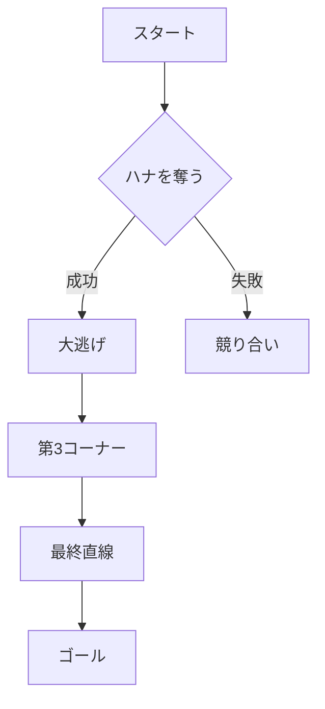

# サイレントスズカの魅力

これはVitePressの機能紹介を兼ねた、サイレントスズカのサンプル記事です。

## スピードの方程式 (KaTeX)

逃げ馬の速度方程式は、加速度 $a(t)$ の積分として次のように表すことができます。

$$
v(t) = v_0 + \int_{0}^{t} a(\tau) d\tau
$$

ここで、$v_0$ は初期速度を示します。

## レース展開の分析 (Mermaid.js)

スタートからゴールまでの典型的な展開をフローチャートで可視化します。



## 実装例 (Code Block)

スピードを算出するためのコードスニペットです。

```typescript
// speedCalculation.ts
function calculateSpeed(distance: number, time: number): number {
  return distance / time;
}

// 2000m を 1分58秒(118.0秒) で走破した場合
const speed = calculateSpeed(2000, 118.0);
console.log(`平均速度: ${speed.toFixed(2)} m/s`);
```
